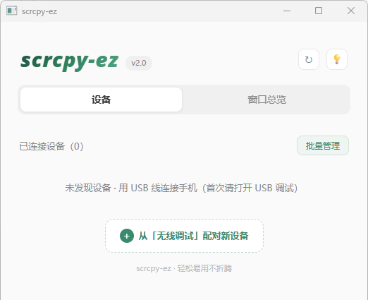
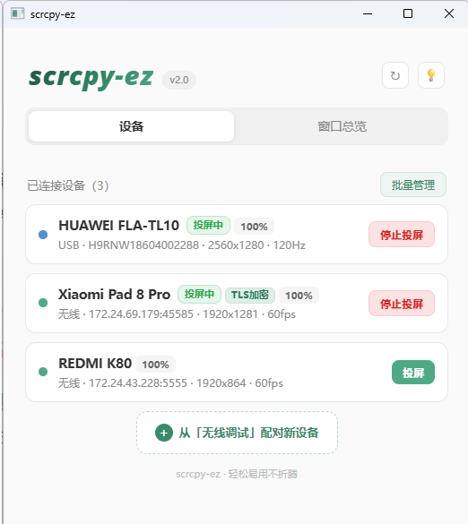
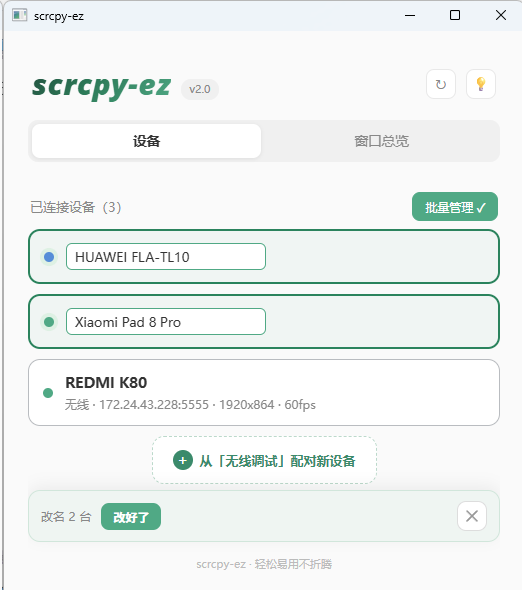
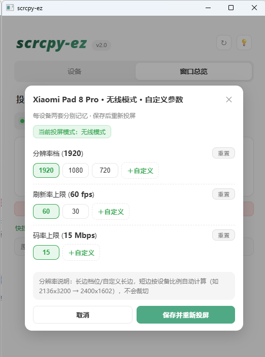

# 🖥️📱 scrcpy-ez — 轻松易用的安卓投屏增强版

> **当前分支：v2.2.2-root.2（root 用户尝试版；普通设备投屏已由用户确认通过，root 尚未实机验证）。** 基于 GitHub ez 2.2.2 的 `b680f551`，独立于 ez 2.2.2 与音墨 2.2.16r2。请单独解压，正式版自动更新已停用。开发分支位于音墨，源码同时镜像至 [ez root 独立分支](https://github.com/kinewe/scrcpy-ez/tree/root-experimental-v2.2.2)。
>
> [尝试版使用说明](doc/root-user-guide-v2.2.2-root.2.md) · [调研与交互分析](doc/root-research-v2.2.2-root.2.md) · [验证记录](doc/root-validation-v2.2.2-root.2.md)。以下为继承的 ez 功能介绍；其中正式版更新说明不适用于此分支。

> **[English](README_EN.md) | 中文**

> 基于 [scrcpy 4.1](https://github.com/Genymobile/scrcpy) 的增强构建，面向「电脑 ↔ Android 移动设备」投屏协同场景。**即开即投，无需折腾。**

> ✨ **本项目由 AI 全程开发**（代码、文档均由 AI 编写）
> ⚠️ **测试平台**：仅 Windows 11 实测（其他版本未经验证）

---

## 🚀 快速开始

### 第一步：开放权限

进入手机/平板的**开发者模式**后，打开 **USB 调试**开关，并允许通过 USB 调试模拟点击行为（例如小米设备还需打开 **USB 调试（安全设置）**）。

<p align="center"></p>

### 第二步：启动

从 [Releases](https://github.com/kinewe/scrcpy-ez/releases) 下载最新版压缩包，解压后双击 **`scrcpy-ez.exe`** 即可启动图形界面。

<p align="center"></p>

### 第三步：配对设备（二选一）

**方式 A：USB 线配对（推荐首次）**

用 USB 线将电脑与手机（平板）连接，**设备弹窗授权**后，GUI 设备列表中即出现已配对设备。

**方式 B：无线调试配对（无需连线）**

1. 在设备上打开 **开发者选项 → 无线调试**，对弹出的授权窗口选择允许
2. 在 GUI 点击 **从「无线调试」配对新设备**
3. 选择以下任一方式：
   - **扫码配对**：扫 GUI 上的二维码即可自动配对
   - **配对码配对**：输入设备上显示的配对码及 IP 地址、端口
4. 若显示 **「未发现待配对设备」**，可手动输入设备上显示的地址与配对码进行配对

### 第四步：投屏

点击设备卡片上的**投屏**按钮即可开始。配对一次后，之后无需重新配对即可投屏（除非手动删除设备）。

- 🔌 **插线** → USB 模式投屏（更高的规格）
- 📡 **拔线** → 自动切换无线（LAN）模式投屏

---

## ✨ 主要特性

### 🖥️ 图形界面设备管理

已配对设备自动发现并以卡片展示，**支持多台设备同时并行投屏**。右键卡片可删除配对信息；批量管理界面支持批量删除、改名与批量投屏。

<p align="center">&nbsp;</p>

### ⌨️ 打字友好

无需额外设置，即可直接在投屏窗口利用电脑键盘输入。

<p align="center"></p>

<p align="center"></p>

> 注：至少为 **Android 13+** 支持 UHID 键盘，低于该版本将无法直接输入。

### 🖼️ 图片剪贴板

吸取了 scrcpy PR #6676 功能——不止是文本，电脑端到移动端复制的**各类图片**也能进入移动端设备剪贴板。

<p align="center"></p>

在支持剪贴板发送图片的应用里可以**粘贴与发送**（输入栏长按并选粘贴 / Ctrl+V），例如微信：

<p align="center"></p>

> 注：移动端应用发送剪贴板图片时可能进行裁切与转化，直接粘贴会模糊（动图不动等）——此时按 **Ctrl+G** 将该图保存至手机（平板）相册，再打开相册用原图发送即可。（保存相册功能 Android 7.0+ 可用，但剪贴板可能不显示。）

<p align="center"></p>

> 保存后点击相册找图发送！

### 🎯 画面跟手感优化

利用**自适应帧率/码率**，让画面较为跟手（非游戏水准，并非为此设计），等待感大幅降低。使用中瞬时帧率下降、画面变模糊是**正常现象**（系统按负载自动调节）。

> 注：较旧设备（Android 9 或以下）将固定低刷新率与码率。

### 🎛️ 规格自定义

点击「规格面板」可自行调整当前设备、当前连接方式的投屏参数。有线模式和无线模式之间互不影响，各设备之间相互独立。

<p align="center"></p>

### 🎮 快捷键

| 快捷键 | 功能 |
|---|---|
| **Ctrl+F** | 投屏参数控件开关（控件可按住 **Alt** 拖动位置）|
| **Ctrl+G** | 将从电脑复制的图保存至手机（平板）相册 |
| **Ctrl+H** | 投屏期间将手机（平板）黑屏以省电（设备可能进入省电模式限制刷新率）|
| **Ctrl+T** | 投屏窗口置顶开关（或按住 **Alt** 点击参数控件左侧指示灯，效果相同）|
| **Alt+F** | 全屏 |

> 💡 **置顶指示**：参数控件左侧的指示灯——置顶时亮橙灯，未置顶为灰点。按住 **Alt** 点击指示灯可激活/取消窗口置顶，与 **Ctrl+T** 效果相同，再次点击可取消置顶。

<p align="center"></p>

<p align="center"></p>

### 📲 手机端通知与主动停止投屏

投屏时，设备通知栏会显示一条常驻的「scrcpy-ez 正在投屏」通知——**点按通知即可直接从手机（平板）停止投屏**，无需回到电脑操作；投屏结束后通知会自动撤下。

<p align="center"></p>

---

## 📜 版本特性

| 版本 | 特性 |
|---|---|
| **v2.2.2** | USB 插拔事件驱动，不再依赖 2 秒轮询；修复批量投屏漏启和卡片状态延迟；完善设备档案身份与地址隔离、应用图标缓存；修复小米系列应用投屏影响实体屏手势和组件尺寸，其他品牌提供兼容开关；多窗口图片与文本剪贴板协调，关闭全部投屏后仍可粘贴图片；统一 UHID/SDK 显示并简化设置说明；修复更新成功提示重复出现及发布包应用列表、图标查询版本不匹配；修复投屏期间设备改名光标消失和输入中断 |
| **v2.2.1** | 新增应用内更新：GitHub / Gitee 双源自动选择、下载续传、重启安装与失败回滚；优化 USB 学习与无线地址同步、应用列表刷新及界面布局 |
| **v2.2.0** | 新增「应用窗口」：单个手机应用可在电脑上以独立窗口运行（多开 / 窗口跟随 / 界面密度 / 每应用独立参数记忆）；音视频编码可选——H.264/H.265/AV1/VP8/VP9 × Opus/AAC/FLAC/RAW；修复旧版 adb 服务占用导致的配对/启动「操作失败」问题 |
| **v2.1.0** | 设备端「正在投屏」通知（点按即可停止投屏）；优化资源消耗；新增「设置」面板：可调整参数控件默认显示开关；允许关闭窗口时最小化到托盘（投屏不中断）|
| **v2.0** | GUI 图形界面：设备卡片、多设备并行、批量管理、无线扫码/配对码配对、有线/无线规格独立、TLS 标识 |
| **v1.0.1** | Ctrl+T 窗口置顶开关、参数控件左侧发光指示灯（置顶亮橙灯/未置顶灰点，按住 Alt 点击指示灯也可切换）|
| **v1.0** | 首发：打字友好（UHID 键盘）、图片剪贴板（PR #6676 + Ctrl+G 存相册）、画面跟手（ABR 自适应）、TSF 输入法、老设备兼容、投屏循环 + USB/WiFi 自动切换 |

---

## 🛠️ 构建（源码）

```bash
# Server（Android 端）：
cd server && export JAVA_HOME=/path/to/jdk17
gradle --no-daemon assembleRelease
# 产物 → 复制为 dist/scrcpy-server

# Client（Windows 端）：
cd build && PATH=/f/msys64/mingw64/bin:$PATH ninja
# 产物 → 复制为 dist/scrcpy.exe
```

> Win 端 GUI 通过 GitHub Actions 构建（见 `.github/workflows/gui-win-build.yml`），产物为 `scrcpy-ez-win64`。

---

## 🙏 致谢

- [scrcpy](https://github.com/Genymobile/scrcpy)（Genymobile）—— 本项目的基石，Apache License 2.0 许可
- [yume-chan 的 PR #6676（Support image clipboard）](https://github.com/Genymobile/scrcpy/pull/6676) —— 图片剪贴板功能借鉴自该 PR

---

> 💻 **运行环境**：Windows 10 / 11（64 位）。图形界面依赖微软 WebView2 运行时——Win11 已内置、Win10 多数已随系统更新安装（若缺失可到 [微软官网](https://developer.microsoft.com/microsoft-edge/webview2/) 安装 Evergreen 版）；其余组件均已包含在压缩包内，无需额外安装运行库。

## 📄 License

Apache License 2.0（继承自 scrcpy 官方）。
