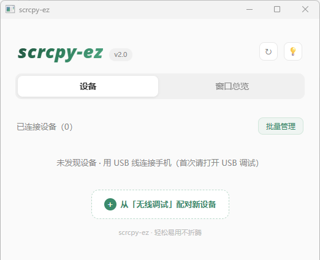
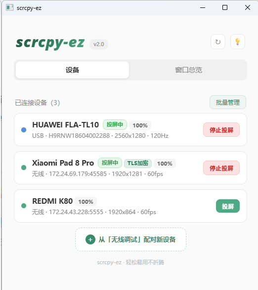
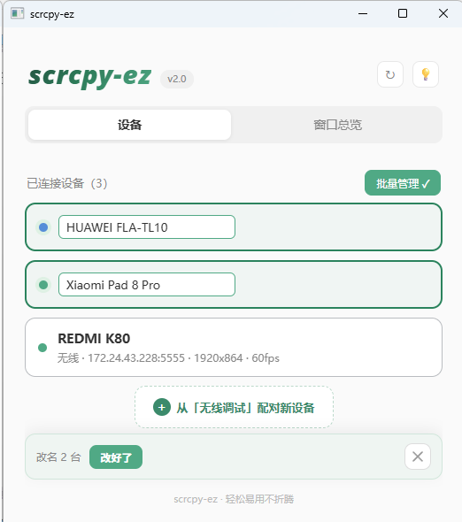
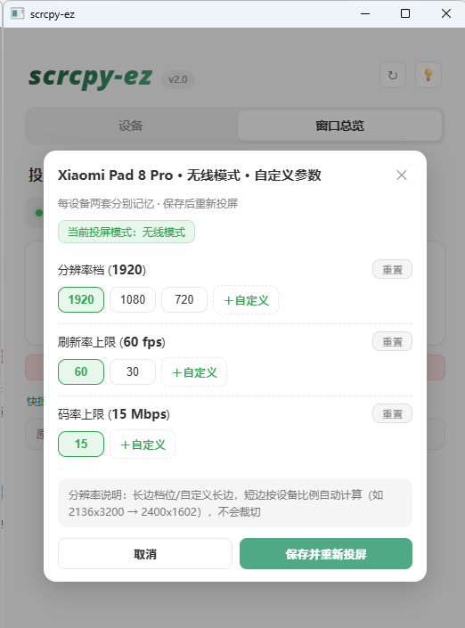

# 🖥️📱 scrcpy-ez — Easy Android Screen Mirroring, Enhanced

> **English | [中文](README.md)**

> An enhanced build based on [scrcpy 4.1](https://github.com/Genymobile/scrcpy) for PC ↔ Android mirroring. **Plug and play, zero hassle.**

> ✨ **Entirely developed by AI** (code and docs written by AI)
> ⚠️ **Tested on**: Windows 11 only (other versions unverified)

---

## 🚀 Quick Start

### Step 1: Enable permissions

Enter **Developer Mode** on your phone/tablet, enable **USB Debugging**, and allow simulating click actions via USB debugging (e.g. Xiaomi devices also need **USB debugging (Security settings)**).

<p align="center"></p>

### Step 2: Launch

Download the latest package from [Releases](https://github.com/kinewe/scrcpy-ez/releases), extract it, and double-click **`scrcpy-ez.exe`** to open the GUI.

<p align="center"></p>

### Step 3: Pair a device (either way)

**Option A: USB cable pairing (recommended for first time)**

Connect the phone/tablet to the PC with a USB cable, **allow the authorization dialog** on the device, and the paired device appears in the GUI device list.

**Option B: Wireless debugging pairing (no cable needed)**

1. Enable **Developer options → Wireless debugging** on the device, and allow the authorization dialog
2. In the GUI, click **Pair new device from "Wireless debugging"**
3. Choose either of:
   - **QR code pairing**: scan the QR code shown in the GUI to pair automatically
   - **Pairing code pairing**: enter the pairing code plus IP address and port shown on the device
4. If you see **"No pending device found"**, you can manually enter the address and pairing code shown on the device

### Step 4: Start mirroring

Click the **Mirror** button on the device card. Once paired, no re-pairing is needed for later sessions (unless you remove the device).

- 🔌 **Keep the cable plugged in** → USB mode (higher specs)
- 📡 **Unplug the cable** → automatically switches to wireless (LAN) mode

---

## ✨ Key Features

### 🖥️ GUI Device Management

Paired devices are discovered automatically and shown as cards, **with multiple devices mirroring simultaneously**. Right-click a card to remove pairing info; the batch management view supports batch removal, renaming and batch mirroring.

<p align="center">&nbsp;</p>

### ⌨️ Keyboard Friendly

No extra setup needed — type directly into the mirroring window with your computer keyboard.

<p align="center"></p>

<p align="center"></p>

> Note: **Android 13+** supports UHID keyboard; on lower versions direct typing is not available.

### 🖼️ Image Clipboard

Inspired by scrcpy PR #6676 — not only text: **images** copied on the PC can enter the device clipboard as well.

<p align="center"></p>

In apps that support clipboard images you can **paste and send** (long-press the input field and choose paste / Ctrl+V), e.g. WeChat:

<p align="center"></p>

> Note: mobile apps may crop/convert clipboard images, so direct paste can be blurry (and animated images won't move) — in that case press **Ctrl+G** to save the image to the device gallery, then send the original from the gallery. (Gallery saving requires Android 7.0+, clipboard may not display on some devices.)

<p align="center"></p>

> Save it, then pick the image from the gallery and send!

### 🎯 Responsive Mirroring

Adaptive **frame rate / bitrate** keeps the image responsive (not game-grade, not designed for that), greatly reducing the latency feel. Temporary frame drops or blurring during use are **normal** (the system adjusts to load).

> Note: older devices (Android 9 or below) are fixed to low refresh rate and bitrate.

### 🎛️ Spec Customization

Open the **Specs panel** to adjust the mirroring parameters for the current device and connection mode. Wired and wireless modes are independent, and each device keeps its own settings.

<p align="center"></p>

### 🎮 Shortcuts

| Shortcut | Function |
|---|---|
| **Ctrl+F** | Toggle the overlay controls (drag them while holding **Alt**) |
| **Ctrl+G** | Save the image copied on the PC to the device gallery |
| **Ctrl+H** | Black out the device screen to save power (the device may enter power-saving mode limiting the refresh rate) |
| **Ctrl+T** | Toggle always-on-top for the mirroring window (or hold **Alt** and click the indicator on the left of the controls, same effect) |
| **Alt+F** | Fullscreen |

> 💡 **Pin indicator**: the small light on the left of the overlay controls — orange when pinned, grey when not. Hold **Alt** and click the indicator to toggle pinning (same as **Ctrl+T**); click again to unpin.

<p align="center"></p>

<p align="center"></p>

---

## 📜 Version History

| Version | Features |
|---|---|
| **v2.0** | New GUI: device cards, multi-device parallel mirroring, batch management, wireless QR/pairing-code pairing, independent wired/wireless specs, TLS indicator |
| **v1.0.1** | Ctrl+T always-on-top toggle, glowing indicator on the left of overlay controls (orange when pinned / grey when not; hold Alt and click it to toggle) |
| **v1.0** | Initial release: keyboard friendly (UHID), image clipboard (PR #6676 + Ctrl+G to gallery), responsive mirroring (adaptive ABR), TSF input method, legacy device support, mirroring loop + USB/WiFi auto-switch |

---

## 🛠️ Build from source

```bash
# Server (Android side):
cd server && export JAVA_HOME=/path/to/jdk17
gradle --no-daemon assembleRelease
# Output → copy as dist/scrcpy-server

# Client (Windows side):
cd build && PATH=/f/msys64/mingw64/bin:$PATH ninja
# Output → copy as dist/scrcpy.exe
```

> The Windows GUI is built via GitHub Actions (see `.github/workflows/gui-win-build.yml`), artifact `scrcpy-ez-win64`.

---

## 🙏 Acknowledgments

- [scrcpy](https://github.com/Genymobile/scrcpy) (Genymobile) — the foundation of this project, Apache License 2.0
- [yume-chan's PR #6676 (Support image clipboard)](https://github.com/Genymobile/scrcpy/pull/6676) — the image clipboard feature is inspired by this PR

## 📄 License

Apache License 2.0 (inherited from scrcpy upstream).
